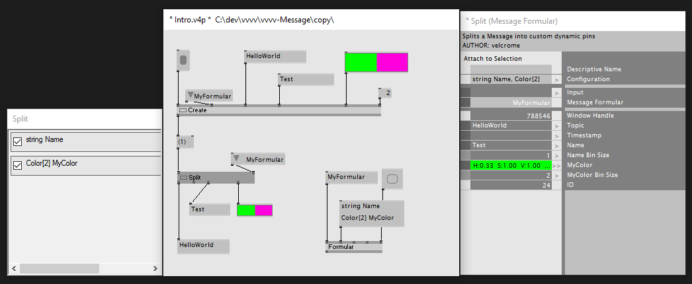

The Message Nodes
=================

If you've ever wondered, if there is a smarter way to pack pins and links into some kind of "objects" in vvvv, you've come to the right place. **Message** is a versatile data structure made to make patching easier.

1. Have you ever had too many links in your project? So much so, as you would wanted to throw it all away and redo it?
1. Did you instead start to to Zip and Cons stuff together, and pick it apart somewhere else. But in the end, it was hell again, because all needed to line up?
1. You felt forced to add `S` and `R` nodes extensively? And finding out, the links are still there, just not visible anymore...?
1. You swamped yourself in logic, trying to get consistent states 
1. Have you ever wondered, what object oriented data flows would look like, kept unfrozen?

If you answered one of the questions with yes, this pack deserves a peak, because it might help you the next time you are in that situation.

This pack is a suite of user-centered nodes to allow basic object oriented programming in good old vvvv. There are a couple essential nodes you will use a lot:

* `Create (Message)` **Message** instances from core vvvv types as inputs through named and typed pins
* `Edit (Message)` and `Split (Message)` **Messages** with your most common types in vvvv

Just using those alone will go a long way, when just combined with a simple `HoldKeep (Message)`

Once you started layouting your first pins, you might find more advanced nodes useful, because they
* help you to facilitate memory persistence through [Keep Nodes](doc/Keep.md) 
* serialize from and to *Json*, *MsgPack* and *OSC*
* can be used with [vvvv-ZeroMQ](https://github.com/velcrome/vvvv-ZeroMQ) for all networking business with **Message**, as the saying goes, on steroids
* allow reshaping **Message**s to dock one API to another 

Nodes are modeled to the principle of typed fields, rapid use, resilience, and readability.

First Things First
==================

First thing to be asked is usually: "How does it improve my patching experience". This is done by introducing a new GUI element to vvvv as an extra window. To see it yourself, install the pack, doubleclick a fresh vvvv patch and pick `Create (Message)`. 
Just right-click it and you will see its pin configuration in the window popping up. This so-called **Formular** defines, which pins will be bundled into a **Message**

Double-click in the window to prepare another pin, just rename it and make sure it is checked for usage. You'll see a new pin added to the node, becoming part of the **Message**.

To do so, you simply type its *Type* and its name, separated by a whitespace. 
You can infuse any number of pins into one or many *Message*s.
If you wish to create multiple **Messages** simultaneously with the node, just make sure your bin sizes are set correctly. To make life easier here, you can even use array syntax after the *Type* as in the picture.

Interfacing back to vvvv is done the exact same way by `Split (Message)`. 

It might not strike you as surprising, `Edit (Message)` uses the same UI to help you edit an existing **Message** while it passes through.

While patching along, you'll explore the dynamic approach to OOP: you can have a slightly different use for all nodes, and have to make sure you are still on the same page with every node.

Of course, this is hard on the mind, especially in larger projects that might need to be maintained for some time. So there is a different, stricter mode built into this pack, helping you to define a **Formular**, which acts as a kind of template for a whole bunch of nodes. This template is known across your vvvv application, so it's easy to apply the Formular to any of the mentioned nodes, and guide you to a proper object oriented data stream.

Refactoring
===========

[Using](doc/Formular.md) strict **Formular**s is a little bit like IntelliSense within vvvv. 

If some time during on during your project, you decide to rename a few things, that you then know more about conceptually, you can do so safely.
If a **Message** node detects incompatibility with an updated **Formular**, it will hightlight in red, so you can fix them. 

After renaming it in for the `Formular (Message)`, press Update on it, and it will attempt to "autofix" all involved nodes. Everywhere this fix would break links, it will light up in red, until you manually cleared the link situation. 
This "exceptional" behaviour does not induce problems to the node itself, it will be working and processing data like before, even if it rings the alarm.

