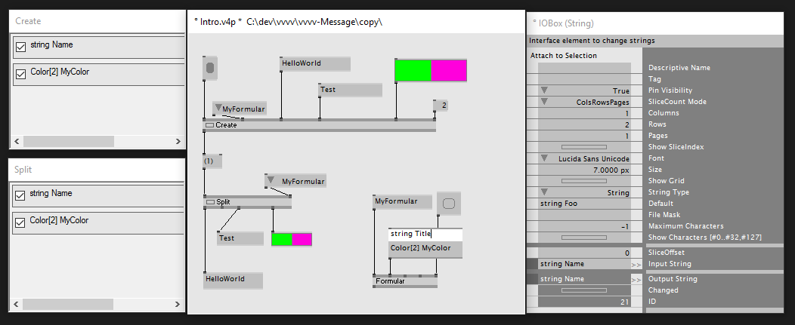
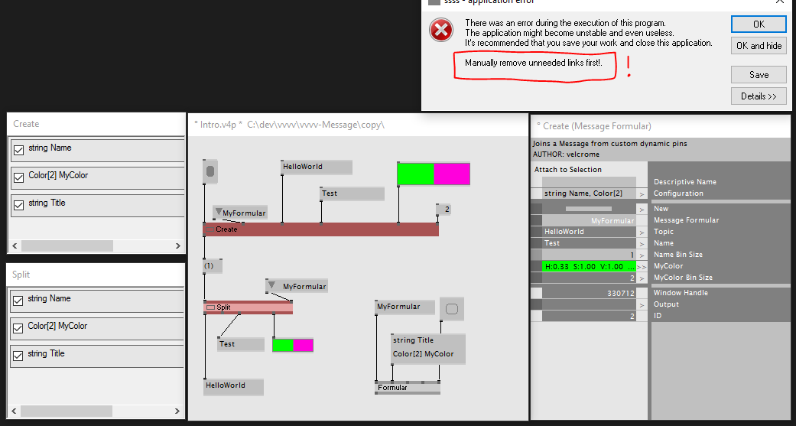

The Message Nodes
=================

If you've ever wondered, if there is a smarter way to pack pins and links into some kind of "objects" in vvvv, you've come to the right place. **Message** is a versatile data structure made to make patching easier.

This pack is a suite of user-centered nodes to allow basic object oriented programming in good old vvvv. There are a couple essential nodes you will use a lot:

* `Create (Message)` **Message** instances from core vvvv types as inputs through named and typed pins
* `Edit (Message)` and `Split (Message)` **Messages** with your most common types in vvvv

Once you started packing your first pins, you might find more advanced nodes useful, because they
* help you to facilitate memory persistence through custom archive Nodes in the  *Message Keep* category
* allow reshaping **Message**s to dock one API to another 
* serialize from and to *Json*, *MsgPack* and *OSC*
* can be used with [vvvv-ZeroMQ](https://github.com/velcrome/vvvv-ZeroMQ) for all networking business with **Message**, as the saying goes, on steroids

Nodes nodes are modeled to the principle of typed code, rapid workflow, resilience, and readability.

First Things First
==================

First thing to be asked is usually: "How does it improve my patching experience". This is done by introducing a new GUI element to vvvv as an extra window. To see it yourself, install the pack, doubleclick a fresh vvvv patch and pick `Create (Message)`. 
Just right-click it and you will see its pin configuration in the window popping up. This so-called **Formular** defines, which pins will be bundled into a **Message**

Double-click in the window to prepare another pin, just rename it and make sure it is checked for usage. You'll see a new pin added to the node, becoming part of the **Message**.

To do so, you simply type its *Type* and its name, separated by a whitespace. 
You can infuse any number of pins into one or many *Message*s.
If you wish to create multiple **Messages** simultaneously with the node, just make sure your bin sizes are set correctly. To make life easier here, you can even use array syntax after the *Type* as in the picture.

Interfacing back to vvvv is done the exact same way by `Split (Message)`. 

It might not strike you as surprising, `Edit (Message)` uses the same UI to help you edit an existing **Message** while it passes through.

While patching along, you'll explore the dynamic approach to OOP: you can have a slightly different use for all nodes, and have to make sure you are still on the same page with every node.

Of course, this is hard on the mind, especially in larger projects that might need to be maintained for some time. So there is a different, stricter mode built into this pack, helping you to define a **Formular**, which acts as a kind of template for a whole bunch of nodes. This template is known across your vvvv application, so it'S easy to apply the Formular to any of the mentioned nodes, and guide you to a proper object oriented data stream.

Refactoring
===========

Using strict **Formular**s is a little bit like IntelliSense within vvvv. 

If some time during on during your project, you decide to rename a few things, that you then know more about conceptually, you can do so safely.
If a **Message** node detects incompatibility with an updated **Formular**, it will hightlight in red, so you can fix them. 

After renaming it in for the `Formular (Message)`, press Update on it, and it will attempt to "autofix" all involved nodes. Everywhere this fix would break links, it will light up in red, until you manually cleared the link situation. 
This "exceptional" behaviour does not induce problems to the node itself, it will be working and processing data like before, even if it rings the alarm.

Field Declaration
============

Declarations of *Fields* happen a lot with **Message**, because it defines the internal structure of the message. It is the same with boththe window panel for Nodes set to Formuular "None", and with the `Formular (Message)` inputs.

Think of **Message** as a collection *Fields*, which is basically a named (and binsizeable) Spread of any of the various Types following:

* *bool*, *int*
* *float*, *double*
* *string*
* *Vector2d*, * *Vector3d*, * *Vector4d*
* *Transform* 
* *Color* - with alpha 
* *Raw* - a.k.a. Stream 
* *Time* - from tmp's [Time](https://github.com/letmp/vvvv-Time)
* **Message** - yes, it is nested and opens the door for recursion

Use any one of those Type aliases as you would in c#, something like 

> string MyFirstWord

First declare the *Fields* Type, then declare its name. For names, CamelCase is usually a good choice.
A declaration like above will yield a *Field* of Type string with a single value. 

> Time[10] MyTenFirstDates

This, on the contrary will yield structure for a list of 10 localized timestamps. This helps when using the ubiquitous `Create (Message)`, `Edit (Message)` and `Split (Message)`, because their pins will not only have the *Field*'s name, but also a preset bin size. Leave the array index empty, if you you don't know the number of items in the *Field* yet, just like this:

> Color[] FavoriteColors

Formular
========

A **Formular** is basically a description a **Message**, in fact many of them can be created from a single **Formular**. It simply provides a basic set of named and typed *Field*s.

It comes in two flavors. The obvious one is in the `Formular (Message)`. But don't be fooled, this one only allows you to define Formulars application wide. For prototyping, you can design a custom Formular  to each relevant node! That's right, when you click yourself a pin layout in a layout window, you are actually defining an internal Formular for that very node.

**Formular** is still quite spartan. No fancy metadata like min/max or precise default management provided yet. However, it allows a very blunt form of inheritance by simply flattening out all parent **Formular**s and prior checking for conflicts.

Message Keep
============

One way to grasp a *Keep* is to take it as an archive of **Message**s. While a 'normal' **Message** only has a life cycle of 1 frame, a *Keep* can, well, 'keep' it for the next or any other number of vvvv's frames. This archive keeps also tight management about any change to all kept **Message**s, no matter where in your patch it happens, up AND down. 

> If this sounds all too arcane to you, let me tell you that this kind of stuff was necessary.
> Necessary to go about the weirdness, if you have multiple editing nodes in arbitrary evaluation order, which is ofc a valid vvvv proposition

VVVV veterans might be wondering about the lack of easily recognizable node names, like S+H, Queue, Buffer and the likes. Instead, this pack relays you onto the new concept of 'Keep'. This suite's been called "exotic" for this. During the years of development, it became clear, that **Message** needs a different breed of stateful nodes, that are more focussed on "joining" Messages, then an "replacing values", because that's what commonly happens: only a few *Fields* within your dataset will actually change during the same frame.

> Isolated changed *Field*s are commonly called **Diff** for the *Keep* nodes, and can be activated with Herr Inspektor.

The reason why the *Keep* nodes might feel exotic at first, is because they are high-level abstractions of patch patterns that occurred recently.

Hold
----

The `Hold (Message Keep)` node is a prime example. It unifies a known `S+H` with a `Change` on its input, because that's what you do in 80% of the use cases.

Safe
----

The `Safe (Message Keep)` conveys even more complex scenarios, where you were forced to sift against a dictionary descriptor before updating a single item. This is all done for you here, if a **Message** with a matching *Topic* is inputted into this *Keep*

Session
-------

This node is very similar to the Safe, but it allows **Message** matching not only for the *Topic*, but for any amount of matching *Field*s.
It comes in handy, if you compare device ids or web session ids, hence the name.

Config
------

This node is your shortcut to have a 

Have you ever had too many links in your project? 

Maybe your project was even so cluttered in links, it became necessary to Zip and Cons stuff together, and pick it apart somewhere else. In this case it is hard to remember what's what, and hence even harder to maintain the project long term?

This happened to you, while you used S and R nodes? 

Basic nodes such as `Create (Message)`, `Split (Message)`, `Edit (Message)` allow interfacing these vvvv link types easily. Right-Click any node to see it's defining Formular, and check which one's of them you need as pins.

When you don't have a formular selected, you can create a dynamic pin layout by simply double-clicking into the empty area of the Formular and editing any descriptor. 

Note, that all pins are accompanied by a hidden bin size. This means, that any field of a **Message** can be one or many items.

Also you'll see that all access to the fields of a message is "named"- including the vvvv pins. You can use `Read (Message)` and `Write (Message)` to that advantage.
